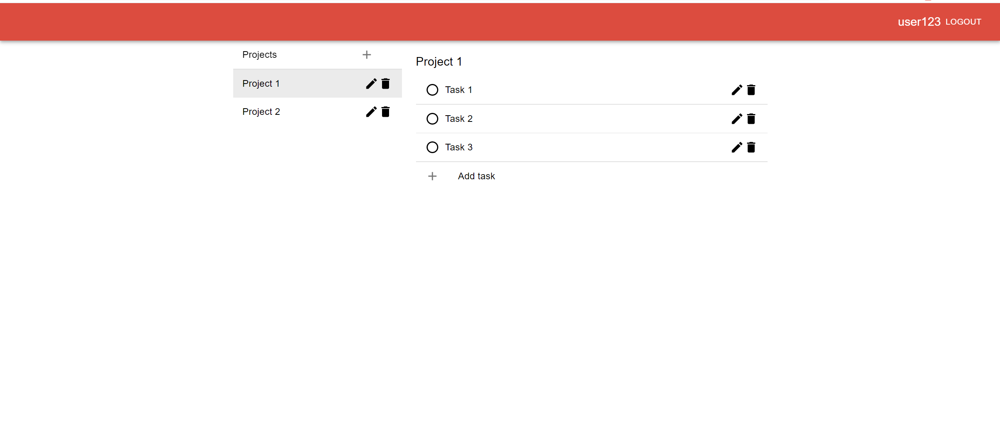

# todo-app

## Description

This is a bare-bones todo application which includes the following functionality:
- User accounts
  - Registering
  - Login
- Projects
  - Collections of todos/tasks
- Todos/tasks

## Technologies used for this project
### Backend
- KoaJS - Web framework for nodeJS
- JWT - Authentication method
- Supertest - Http endpoint testing library
- Mocha - Testing framework
- Istanbul - Unit-test coverage

### Frontend
- ReactJS
- Material-UI
